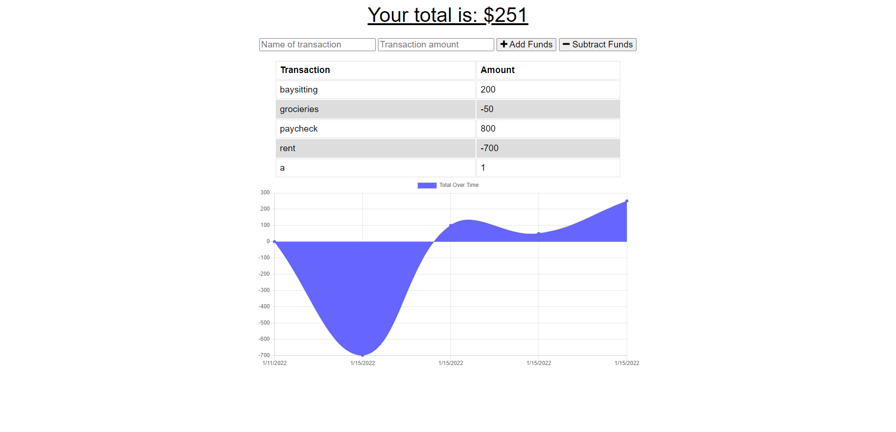

# <h1 align="center">Progressive Web App: Budget Tracker</h1>

    
    

    
    

# Description:
A Progressive Web App in the form of a budget tracker.

# Table of Contents:
- [Description](#description)
- [Installation](#installation)
- [Usage](#usage)
- [Contribution](#contribution)
- [Tests](#tests)
- [License](#license)
- [Questions](#questions)

# Installation:
Deployed at: https://pwabudgettracker-showcase.herokuapp.com/

# Usage:
Intended for use as a showcase of skill with webpack and PWA methodology.

# Contribution:
N/A

# Tests:
Chrome Web Dev Tools

# License:

For more information, please go to <a href="https://choosealicense.com/licenses/" target="_blank">choosealicense.com/licenses/</a>

# Questions:
Find me on GitHub: [t-norm](https://github.com/t-norm)

Email me with any questions: tnorman600@gmail.com